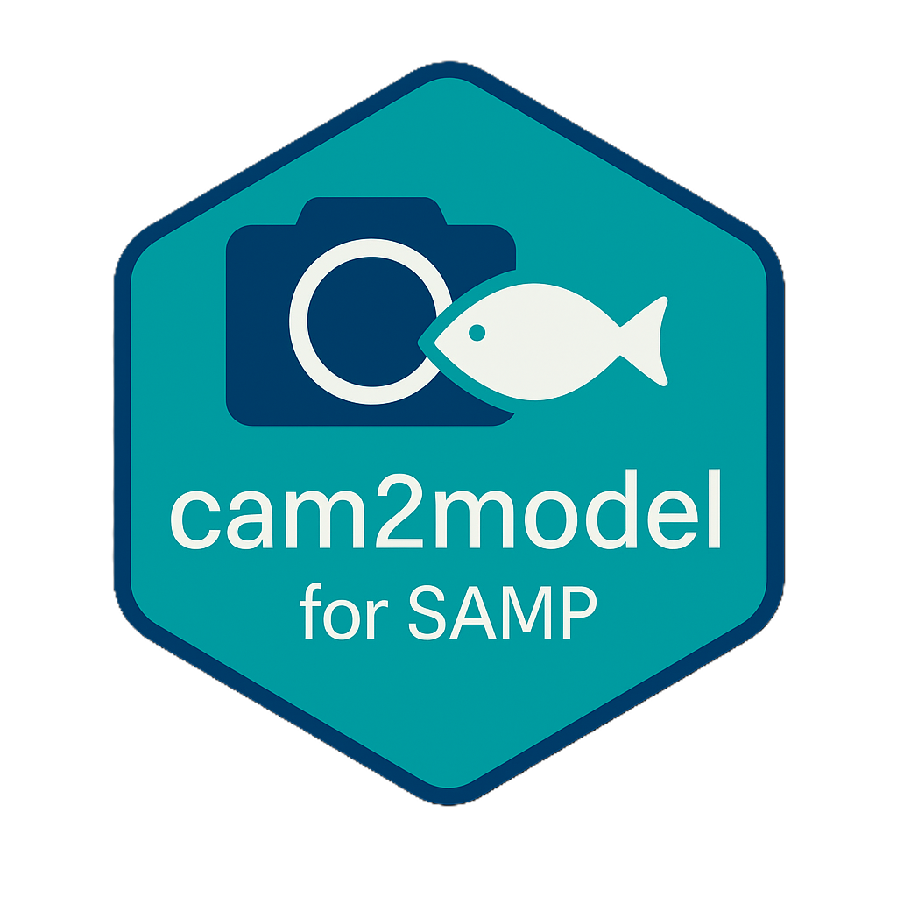
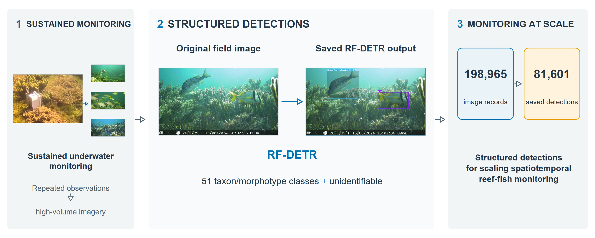

<div align="center">
  
  &nbsp;&nbsp;&nbsp;&nbsp;
  

  <h1>Scaling spatiotemporal reef-fish monitoring with computer vision in the southern Gulf of Mexico</h1>

  <p><strong>reef-fish-rfdetr</strong></p>
  <p><em>Reproducible computer-vision workflow for spatiotemporal reef-fish monitoring</em></p>

  <p>
    
    
    
  </p>
</div>

## Authors and affiliation

**Authors:** Edlin José Guerra Castro; Arturo Sanchez-Porras; Fernando Nuno Diaz Marques Simoes; Ángela Randazzo-Eisemann; Ilse Ruiz-Mercado; Vanesa Papiol; Víctor Eduardo Gómez-Bretón; Damián Alejandro Cedillo-Reyna; Alan Javier Ramírez-Menéndez; Miguel Ángel Plata-Díaz; Rodrigo Contreras-Chávez; Ximena Isabel Pérez-Meza

**Project affiliation:** Escuela Nacional de Estudios Superiores, Unidad Mérida, Universidad Nacional Autónoma de México (UNAM), Mérida, Yucatán, Mexico

<div align="center">
  
</div>

**Reproducibility status:** The curated package passes its headline numerical and release-integrity checks. Figures 3–5 are reproducible from retained public inputs; the numerical panels of Figures 2 and 6 are reproducible without the restricted photographic assets. See [Reproducibility status](docs/REPRODUCIBILITY_STATUS.md).

[Overview](#overview) · [Scientific record](#scientific-record) · [Repository contents](#repository-contents) · [Quick verification](#quick-verification)  
[Reproducing figures](#reproducing-figures) · [Diagnostic workflows](#diagnostic-workflows) · [Model availability](#model-availability) · [Data availability](#data-availability)  
[Funding](#funding) · [Citation](#citation) · [License](#license) · [Status](#status)

## Overview

Sustained autonomous underwater monitoring can extend temporal coverage and spatial reach, but repeated sampling can generate image volumes that exceed manual interpretation capacity. Converting those images into taxonomically resolved observations becomes a processing bottleneck as monitoring intensifies.

This repository contains the reproducible code, verified configuration, derived evaluation records, corrected diagnostics, leakage-sensitivity outputs, and figure inputs supporting an RF-DETR workflow for reef-fish taxon/morphotype detection. The workflow addresses the image-processing constraint on scaling spatiotemporal reef-fish monitoring while keeping model detections distinct from unique fish individuals or validated ecological estimates.

### Where to start

| Goal | Location |
|---|---|
| Reproduce headline checks | [`tests/`](tests/) |
| Reproduce public-safe figure panels | [`scripts/figures/`](scripts/figures/) |
| Inspect corrected diagnostics | [`scripts/diagnostics/`](scripts/diagnostics/) |
| Inspect model metadata and limitations | [`models/MODEL_CARD.md`](models/MODEL_CARD.md) |
| Inspect external-image provenance | [`metadata/`](metadata/) |
| Inspect reproducibility and release notes | [`docs/`](docs/) |

## Scientific record

- Final architecture: RF-DETR Medium, 33,687,458 parameters.
- Operational ontology: 51 fish taxon/morphotype classes plus `unidentifiable` (52 evaluated categories). The COCO parent `fish` is non-operational.
- Export preprocessing: 576 × 576 pixels; detector resolution: 448 pixels.
- Training: 10 epochs on one NVIDIA RTX A2000 6 GB GPU in a Dell Precision 7920; approximately 17 h.
- Model selection: epoch-index-4 EMA, chosen by maximum validation COCO AP@50:95 (0.5255759074475391).
- Held-out image-level test: 520 images and 1,846 ground-truth objects.
- Reported test metrics: mAP@50 0.7407811331; mAP@50:95 0.5448539545; precision 0.7944608346; recall 0.650000.
- Archive application: 198,965 image records and 81,601 saved detections at confidence threshold 0.50. Detections are model outputs, not counts of unique fish.

### Test-set qualification

The test partition is a held-out **image-level** set, not a fully source- or sequence-independent set. A post hoc audit found one train–test source-image duplicate. Removing it changed every paired metric produced by the available sensitivity evaluator by less than 0.00023 and did not change the confusion-matrix or CLIP–UMAP interpretation. The original 520-image RF-DETR metrics remain the primary reported results. Some SAMP images are temporally adjacent across splits; this represents potential dependence rather than exact leakage.

## Repository contents

| Directory | Contents |
|---|---|
| `config/` | Operational class map, preprocessing and augmentation settings, detector/training configuration, and analysis thresholds. |
| `data/derived/` | Dataset summaries, primary test table, corrected diagnostic outputs, retained embeddings, and leakage-sensitivity outputs. |
| `metadata/` | Public external-image provenance manifest and coverage notes; no third-party image pixels. |
| `scripts/` | Portable inference, evaluation, corrected diagnostics, leakage sensitivity, and public-safe figure workflows. |
| `figures/data/` | Plot-ready figure inputs and archive-scale summary. |
| `figures/captions/` | Accepted draft figure captions. |
| `models/` | Model card and checkpoint deposit information. |
| `tests/` | Integrity checks for headline values and figure inputs. |
| `docs/` | Reproducibility, data availability, provenance, design, and release records. |

The repository is a curated copy. It excludes raw SAMP photographs, third-party photographs, mixed Roboflow image exports, model checkpoints, private workbooks, historical runs, local environments, and temporary files, apart from the approved logos and graphical-abstract preview under `docs/assets/`.

## Quick verification

From the repository root:

```bash
python tests/test_public_package.py
```

The test checks Figure 3 model selection, Figure 4 totals and matrix dimensions, Figure 5 image and neighborhood counts, Table 1 values, Figure 2 numerical inputs, Figure 6 archive totals, ontology size, leakage sensitivity, and external-image provenance coverage.

## Reproducing figures

R figure scripts use the retained package versions documented in [`environment/r-package-versions.txt`](environment/r-package-versions.txt):

```bash
Rscript scripts/figures/fig03_model_selection.R
Rscript scripts/figures/fig04_error_structure.R
Rscript scripts/figures/fig05_feature_space.R --v3
Rscript scripts/figures/fig02_dataset_composition.R
Rscript scripts/figures/fig06_archive_scale.R
```

Figures 3–5 are reproducible from the included inputs. Figures 2 and 6 are partially reproducible because their photographic panels use SAMP images or saved image renders that are not redistributed as figure-reproduction data. Their numerical panels are fully represented. Figure 1 cannot be regenerated without its source photographs and saved render.

## Diagnostic workflows

The corrected confusion and vector analyses retain all 520 test images, including images with zero saved detections. Default commands write to `outputs/`:

```bash
Rscript scripts/diagnostics/matriz_confusion_corrected.R
Rscript scripts/diagnostics/vector_analysis_corrected.R
Rscript scripts/leakage_sensitivity/test_leakage_sensitivity_diagnostics.R
```

The diagnostic workflow applies its retained confidence filter of 0.25 and one-to-one matching at IoU ≥ 0.50. The saved predictions already have scores of approximately 0.50 or higher. Diagnostic TP, FP, and FN counts are not the numerators of the original RF-DETR headline precision and recall.

The standalone evaluator in `scripts/evaluation/evaluate_coco_predictions.py` supports the paired leakage-sensitivity calculations. It is **not** represented as the exact RF-DETR implementation that generated the four headline values in `results.json`; the exact RF-DETR package build and precision/recall operating-point implementation were not retained.

## Model availability

The validation-selected checkpoint is `checkpoint_best_total.pth`, containing the epoch-index-4 EMA model. It is not included in this code repository. Its attribution to the final held-out test is author-confirmed and consistent with the retained run record, and the archive-inference script directly specifies the same checkpoint filename.

The final checkpoint will be deposited separately in a DOI-bearing research-data/model repository after license compatibility and deposit conditions are confirmed. No model DOI currently exists. See [`models/MODEL_CARD.md`](models/MODEL_CARD.md) and [`models/README.md`](models/README.md).

## Data availability

- Third-party photographs, including images recorded in the project's iNaturalist source category, are **not redistributed**.
- [`metadata/inaturalist_provenance_manifest.csv`](metadata/inaturalist_provenance_manifest.csv) provides project identifiers, operational labels, split membership, match status, and recovered source URLs where unique mappings were available.
- The manifest recovers a unique valid URL for 2,372 of 2,693 final external-image records (88.08%); 319 mappings are ambiguous and 2 records lack a retained URL.
- Raw SAMP imagery remains restricted pending institutional and project authorization for redistribution.
- The final model checkpoint will be deposited separately once license compatibility is confirmed.
- No Mendeley Data or Zenodo record is claimed to exist at this stage.

Users should consult linked third-party sources under their current terms. A retained URL does not by itself establish creator attribution, license, continued availability, or permission to redistribute an image. See [`docs/DATA_AVAILABILITY.md`](docs/DATA_AVAILABILITY.md) and [`metadata/EXTERNAL_IMAGE_PROVENANCE.md`](metadata/EXTERNAL_IMAGE_PROVENANCE.md).

## Author contributions

**Edlin José Guerra Castro:** Conceptualization, Data curation, Formal analysis, Funding acquisition, Project administration, Writing – original draft, Writing – review & editing.

**Arturo Sanchez-Porras:** Software, Writing – review & editing.

**Fernando Nuno Diaz Marques Simoes:** Conceptualization, Funding acquisition, Writing – review & editing.

**Ángela Randazzo-Eisemann:** Supervision, Validation, Writing – review & editing.

**Ilse Ruiz-Mercado:** Conceptualization, Data curation, Writing – review & editing.

**Vanesa Papiol:** Data curation, Writing – review & editing.

**Víctor Eduardo Gómez-Bretón:** Supervision, Data curation, Investigation, Writing – review & editing.

**Damián Alejandro Cedillo-Reyna:** Supervision, Data curation, Investigation, Writing – review & editing.

**Alan Javier Ramírez-Menéndez:** Data curation, Writing – review & editing.

**Miguel Ángel Plata-Díaz:** Supervision, Data curation, Investigation, Writing – review & editing.

**Rodrigo Contreras-Chávez:** Data curation, Writing – review & editing.

**Ximena Isabel Pérez-Meza:** Data curation, Writing – review & editing.

## Funding

This research was supported by the Dirección General de Asuntos del Personal Académico (DGAPA) of the Universidad Nacional Autónoma de México (UNAM) through the Programa de Apoyo a Proyectos de Investigación e Innovación Tecnológica (PAPIIT), under grant number IN208124, awarded to Edlin Guerra-Castro.

## Citation

Draft citation metadata with the confirmed author list are maintained in [`CITATION_v2.cff`](CITATION_v2.cff). The final release will support four related citation targets without treating any placeholder as an existing identifier:

- **Manuscript:** journal, year, and article DOI to be confirmed.
- **GitHub repository:** repository URL to be added after private staging and author approval.
- **Versioned software archive:** future Zenodo software DOI to be added after release.
- **Research-data/model package:** future Mendeley Data DOI to be added after deposit.

## License

Source code and scripts in this repository are available under the [PolyForm Noncommercial License 1.0.0](LICENSES/PolyForm-Noncommercial-1.0.0.txt). Author-generated derived data and metadata are available under [CC BY-NC-SA 4.0](LICENSES/CC-BY-NC-SA-4.0.txt), unless otherwise noted and only where the authors hold the necessary rights.

Reuse must provide appropriate attribution to PAPIIT-UNAM project IN208124 and to the manuscript authors and project source as appropriate. Commercial use of the source code and licensed research data is not permitted under these licenses.

Photographs, institutional logos, third-party images and software, and model weights may be subject to separate terms and are not automatically covered by these repository-wide licenses. The selected checkpoint remains subject to upstream license-compatibility review. See [`LICENSES/README.md`](LICENSES/README.md), [`NOTICE`](NOTICE), and [`docs/LICENSING_NOTES.md`](docs/LICENSING_NOTES.md).

## Status

This repository is a curated reproducibility package under author review. Headline integrity tests pass, the local Git history is initialized, and no public repository, software DOI, research-data DOI, or journal publication is claimed here. Remaining release decisions include visual-asset rights confirmation, checkpoint license compatibility, the public repository URL, and DOI metadata.

For detailed boundaries, consult [`docs/REPRODUCIBILITY_STATUS.md`](docs/REPRODUCIBILITY_STATUS.md), [`docs/RELEASE_SCAN_REPORT.md`](docs/RELEASE_SCAN_REPORT.md), and [`docs/SCRIPT_PROVENANCE.md`](docs/SCRIPT_PROVENANCE.md).

